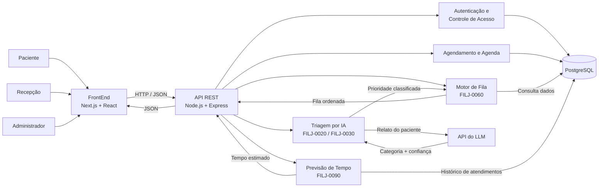

# Arquitetura do FilaJusta — Vida Plena

## 1. Visão geral

O FilaJusta utiliza uma arquitetura cliente-servidor.

O FrontEnd, desenvolvido em Next.js e React, é responsável pelas interfaces utilizadas por pacientes, recepção e administração.

O FrontEnd se comunica por HTTP/JSON com uma API REST desenvolvida em Node.js e Express.

O Backend concentra autenticação, autorização, validações, regras de negócio e acesso ao banco de dados PostgreSQL por meio do Sequelize.

A arquitetura também prevê a evolução do sistema com módulos de triagem por LLM, organização inteligente da fila e previsão de tempo de espera.

## 2. Diagrama de arquitetura



## 3. Arquitetura atual

Atualmente, o projeto está organizado em duas aplicações principais:

- FrontEnd
- backEnd-filaJusta

O FrontEnd utiliza Next.js, React e TypeScript.

O Backend utiliza Node.js, Express, Sequelize e PostgreSQL.

O Backend está organizado em módulos responsáveis por funcionalidades específicas do sistema.

Entre os módulos atuais estão:

- agenda
- autenticação
- consultas
- documentos
- especialidades
- médicos
- pacientes
- usuários

## 4. Comunicação entre FrontEnd e Backend

O FrontEnd envia requisições HTTP para a API REST.

Exemplo de fluxo:

Paciente  
→ FrontEnd  
→ API REST  
→ Regra de negócio  
→ PostgreSQL  
→ API REST  
→ FrontEnd

As informações são trafegadas principalmente em formato JSON.

## 5. Funcionalidades e componentes

| Funcionalidade | FrontEnd | Backend | Persistência / Serviço |
|---|---|---|---|
| Agendamento | Telas de especialidade, médico, horário e dados | Consultas e agenda | PostgreSQL |
| Consulta de agendamento | Tela de consulta | Módulo de consultas | PostgreSQL |
| Login | Tela de login | Autenticação | PostgreSQL |
| Perfis de acesso | Telas de recepção e administração | Middlewares de autorização | PostgreSQL |
| Médicos | Telas administrativas e de consulta | Módulo de médicos | PostgreSQL |
| Especialidades | Seleção e administração | Módulo de especialidades | PostgreSQL |
| Pacientes | Cadastro e consulta | Módulo de pacientes | PostgreSQL |
| Usuários | Administração de usuários | Módulo de usuários | PostgreSQL |
| Documentos | Upload e consulta | Módulo de documentos | Backend / armazenamento |
| Fila de atendimento | Painel da recepção | Motor de fila | PostgreSQL |
| Triagem por IA | Formulário de relato | Serviço de triagem | API de LLM |
| Priorização | Exibição da ordem da fila | Motor de score | PostgreSQL |
| Previsão de espera | Tela de posição e tempo | Serviço de previsão | Histórico do PostgreSQL |

## 6. Triagem por LLM

A triagem por LLM será utilizada como apoio à priorização do atendimento.

O usuário informa em texto livre o motivo do atendimento.

O Backend envia esse relato ao modelo de linguagem.

A resposta esperada deve conter:

- categoria de prioridade;
- nível de confiança.

Exemplo:

```json
{
  "categoria": "alta",
  "confianca": 0.88
}
```

Se a confiança estiver abaixo do limite configurado, o sistema deverá utilizar uma regra de fallback e marcar o caso para revisão humana.

A IA não deve tomar a decisão final de forma isolada.

## 7. Motor de organização da fila

O motor de fila utilizará dois fatores principais:

- prioridade do atendimento;
- tempo de espera.

Uma representação conceitual é:

```text
score = peso_da_prioridade + fator_de_aging
```

O fator de aging aumenta conforme o tempo de espera.

Isso evita que pacientes de menor prioridade fiquem indefinidamente sem atendimento.

A fila deverá ser reordenada conforme os scores forem atualizados.

## 8. Previsão de tempo de espera

O serviço de previsão utilizará dados históricos dos atendimentos.

Os principais timestamps são:

- entrada;
- chamada;
- fim do atendimento.

Inicialmente, a previsão pode utilizar uma média móvel por categoria e horário.

A qualidade das previsões poderá ser avaliada com MAE, Mean Absolute Error.

## 9. Segurança

A API utiliza autenticação JWT e controle de acesso por perfil.

As senhas são protegidas com bcrypt.

Variáveis sensíveis devem permanecer em arquivos `.env`.

Chaves de APIs externas, incluindo a API do LLM, não devem ser versionadas no GitHub.

## 10. Fluxo resumido da arquitetura futura

Paciente  
→ FrontEnd  
→ API REST  
→ Triagem por IA  
→ LLM  
→ Categoria + confiança  
→ Fallback/revisão humana, quando necessário  
→ Motor de fila  
→ Score  
→ Fila ordenada  
→ Recepção

Em paralelo:

Histórico de atendimentos  
→ Serviço de previsão  
→ Tempo estimado  
→ FrontEnd  
→ Paciente
